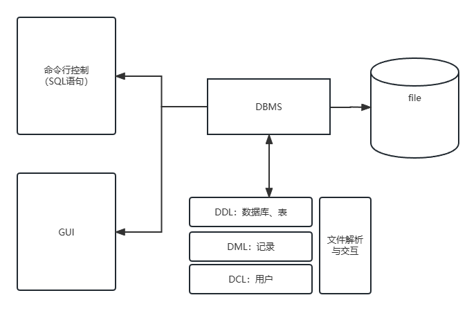
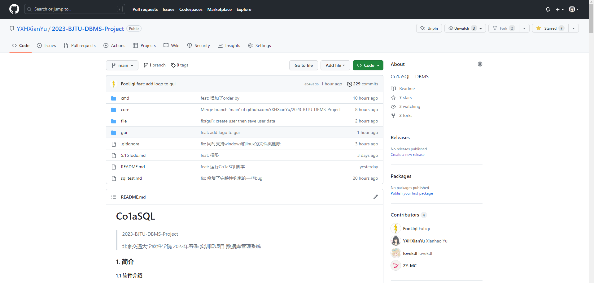
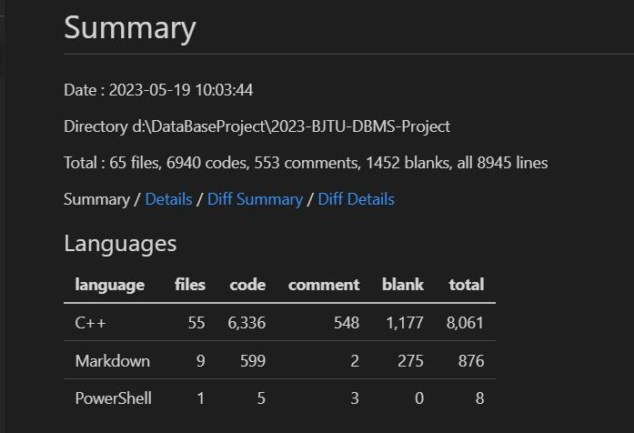

---

marp: true
theme: gaia
paginate: true

---

<!-- _class: lead -->

# DBMS 演示答辩

#### 俞贤皓, 邓人嘉, 付家齐, 谷雅丰

---

# 1. 项目基本介绍

## 1.1 项目架构

- 项目共分为四个模块
  - CMD  命令行模块
  - CORE 核心模块
  - FILE 文件模块
  - GUI  图形界面

---

# 1. 项目基本介绍

## 1.2 模块架构

- 

---

# 2. 基本功能展示

## 2.1 DDL功能实现

- 创建数据库 CREATE DATABASE `database_name`;
- 删除数据库 DROP DATABASE `database_name`;

---

# 2. 基本功能展示

## 2.1 DDL功能实现

- 创建数据库 CREATE DATABASE `database_name`;
- 删除数据库 DROP DATABASE `database_name`;
- 创建表 CREATE TABLE ...;
- 添加字段 ALTER TABLE `表名` ADD `列名` `类型名`;
- 删除字段 ALTER TABLE `表名` DROP `列名`;
- 修改字段 ALTER TABLE `表名` MODIFY `列名` `类型名`;
- 删除表 DROP TABLE `表名`;

---

# 2. 基本功能展示

## 2.2 DML功能展示

- 记录插入 INSERT INTO `表名` `列1` `列2` ... VALUES `值1` `值2`;
- 记录删除 DELETE FROM `表名` [WHERE `筛选条件1` `筛选条件2` ...];
- 记录修改 UPDATE `表名` SET `列1` = `值1` ... [WHERE...];

---

# 2. 基本功能展示

## 2.3 DQL功能展示

- 查询所有数据库 SHOW DATABASES;
- 查询当前数据库所有表 SHOW TABLES;
- 查询表的所有记录 SELECT * FROM `表名`;
- 指定字段和where条件 SELECT `列1` `列2` ... WHERE `筛选条件1`...;

---

# 2. 基本功能展示

## 2.4 GUI界面

- GUI界面

---

# 3. 拓展功能展示

## 3.1 读取SQL脚本

- run `脚本路径`

---

# 3. 拓展功能展示

## 3.2 复杂的SQL查询

- 多表

- 多条件

- 排序

---

# 3. 拓展功能展示

## 3.3 数据持久化/回滚/提交

- Commit

- Rollback

---

# 3. 拓展功能展示

## 3.4 完整性(约束条件)

- Primary Key

- Foreign Key

- Not Null

- Unique

- Default

---

# 3. 拓展功能展示

## 3.5 索引

- 索引效率展示

---

# 3. 拓展功能展示

## 3.6 用户权限管理

---

# 3. 拓展功能展示

## 3.7 GUI点击修改

- GUI点击修改

---

# 4. 项目管理

## 4.1 Git&Github版本管理

- [Co1aSQL](https://github.com/YXHXianYu/2023-BJTU-DBMS-Project/)

---

---

# 4. 项目管理

## 4.2 代码量统计

- 

---

# 4. 项目管理

## 4.3 成员贡献比例

- 俞贤皓: 26%

- 邓人嘉: 26%

- 付家齐: 26%

- 谷雅丰: 22%

---

<!-- _class: lead -->

# Thanks For Listening
