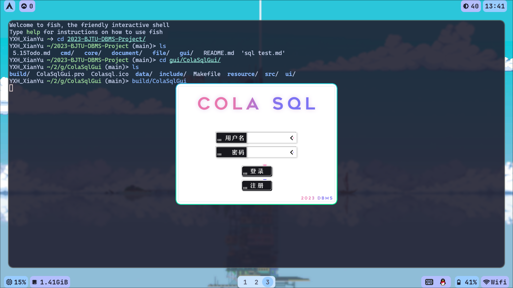
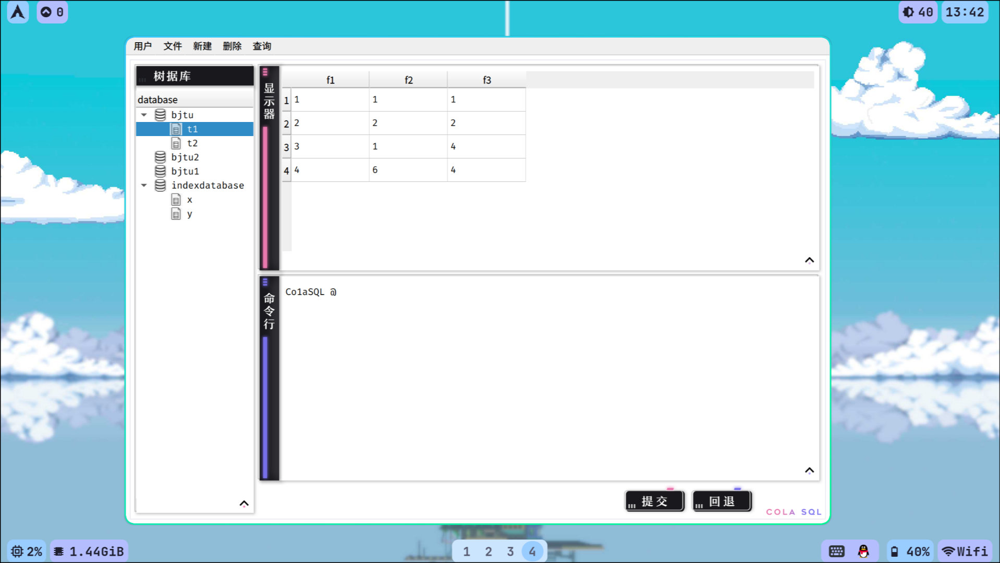

# Co1aSQL 项目结题报告

## 1. 实现功能

### 1.1 基本功能

- SQL解析
- DDL功能实现
- DML功能实现
- DQL功能实现
- GUI界面
- (基本功能均完成)

### 1.2 拓展功能

- SQL脚本文件的执行
- 复杂Select语句
- 数据持久化/事务管理(Commit/Rollback)
- 基于无旋Treap的索引
- 完整性管理（主键、外键、UNIQUE、Not Null、DEFAULT）
- 安全性管理（用户、权限）
- GUI点击修改记录

### 1.3 GUI

- 
- 

## 2. 技术方案设计

### 2.1 C++

- 本项目采用C++作为开发语言。

- C++相对Java、Python等语言，有着执行效率高这一特性，非常适合用于编写数据库管理系统这种对运行效率要求严苛的程序。所以为了使数据库管理系统的运行效率更高，我们采用C++进行开发。

- 本项目采用的C++版本为C++17

### 2.2 Qt

- 本项目采用C++&Qt来实现可视化的图形界面。

- Qt是目前最成熟的C++多媒体库，可以方便快速的实现GUI。

- 同时，Qt也是一个成熟的跨平台库，适用于我们Windows+Linux双平台开发。

### 2.3 项目结构

- 本项目分为四个模块：核心模块、文件模块、命令行接口模块、GUI模块。

- 核心模块负责维护DBMS的数据结构，并且抛出各类管理数据结构的接口，供其他模块操作数据库。

- 文件模块负责操作物理文件，提供操作物理文件的接口。

- 命令行接口模块负责提供命令行接口，使得用户可以通过命令行接口的方式操作数据库。同时，命令行接口模块也负责对SQL语句进行解析，将SQL语句从一条字符串切成一个一个单词，再对单词序列进行解析，转换成对核心模块接口的调用。

- GUI模块提供了图形化界面，使得用户可以通过图形化界面的方式操作数据库。GUI模块会调用命令行接口模块，从而在GUI中内嵌SQL语句的解析，便于操作。GUI模块也提供了一套直接调用核心模块的方法，使得用户可以不通过SQL语句，仅通过图形界面来操作数据库。

* 

## 3. 算法实现描述


## 4. 用户手册

### 4.1 项目构建

#### 4.1.1 项目版本

* gcc 13.1.1
  * c++17

* qt 5.15.9
* cmake 3.26.3
* qmake 3.1

#### 4.1.2 构建CLI

```
cd cmd
cmake -Bbuild
make -Cbuild -j8
```

#### 4.1.3 启动CLI

```
build/colasql admin 123456;
```

#### 4.1.4 构建GUI

```
cd gui/ColaSqlGui
qmake -o build/Makefile ColaSqlGui.pro
make -Cbuild -j8
```

#### 4.1.5 启动GUI

```
build/ColaSqlGui
```

### 4.2 SQL语句

#### 4.2.1 基本约定

* Co1aSQL 支持的SQL语法，均为 **大小写不敏感**。
* Co1aSQL 在预处理SQL语句时，会自动将所有的小括号和逗号替换为空格，以尽可能兼容标准SQL。

#### 4.2.2 用户

* 登入数据库

  ```sql
  colasql 用户名 密码
  #管理员用户名admin，密码colasql
  LOGIN 用户名 密码;
  ```
  
* 创建用户

  ```sql
  CREATE USER 用户名 密码;
  #所有用户默认拥有数据库的查询权、创建权，只对自己创建的数据库有删除权
  #创建用户不需要任何权限，但授予权限只能授予自己拥有的权限
  #其它说明见下
  ```
  
* 修改用户权限

  ```sql
  GRANT USER 用户名 数据库名 表名 权限名;
  #数据库名和表名都不能为"*"，对某个特定的数据库的表授予权限。
  
  GRANT USER 用户名 数据库名 权限名;
  #数据库名为"*"，对所有数据库的所有表授予权限(当前用户拥有该数据库的权限,仅admin可用)。
  #数据库名不为"*"时，若为表级权限则授予该数据库里所有表的表级权限(当前用户需拥有授权的所有权限)，若为数据库级权限则授予该数据库的数据库级权限(当前用户需拥有该权限)。
  ```
  
  * 权限名
  
    ```sql
    #表级权限
    SELECT
    DELETE
    INSERT
    UPDATE
    INDEX
    ALTER
    
    #数据库级权限
    CREATE
    DROP
    
    #ALL表示以上所有权限,仅数据库管理员(admin)可用
    #ALL
    ```
  
* 删除用户（需要管理员权限）

  ```sql
  DROP USER 用户名;
  ```

#### 4.2.3 数据类型

* ```sql
  int    # 42位整数，如 1, 14, 514
  float  # 42位浮点数，如 1.0, 5.1, 2
  string # 字符串，如 "dbms", "2002-10-12"
  ```

#### 4.2.4 数据库

* 创建数据库（需要管理员权限）

  ```sql
  CREATE DATABASE 数据库名;
  ```

* 删除数据库（需要管理员权限）

  ```sql
  DROP DATABASE 数据库名;
  ```

* 使用数据库

  ```sql
  USE 数据库名;
  ```
  
* 显示所有数据库

  ```sql
  SHOW DATABASES;
  ```

#### 4.2.5 表

* 创建表(需要CREATE权限)

  ```sql
  CREATE TABLE 表名
    列名1 类型1
    列名2 类型2
    ...
    
    约束条件1
    约束条件2
    ...
  ;
  ```

  * 约束条件语法
  
    ```sql
    CONSTRAINT 约束名 PRIMARY KEY 列名;                # 指定主键
    CONSTRAINT 约束名 FOREIGN KEY 列名 REFERENCES 表名2 列名2; # 指定外键，该列 参考 表2的列2
    CONSTRAINT 约束名 UNIQUE 列名;                   # 指定该列值不可重复（未指定时，默认可重）
    CONSTRAINT 约束名 NOT NULL 列名;                 # 指定该列非空（未指定时，默认可空）
    CONSTRAINT 约束名 DEFAULT 列名 值;               # 指定该列默认值（未指定时，默认值为NULL）
    ```
  
* 删除表(需要DROP权限)

  ```sql
  DROP TABLE 表名;
  ```

* 修改表(需要ALTER权限)

  ```sql
  ALTER TABLE 表名 ADD 列名 类型;
  ALTER TABLE 表名 DROP 列名;
  ALTER TABLE 表名 MODIFY 列名 类型;
  ALTER TABLE 表名 约束条件;
  ALTER TABLE 表名 DELETE 约束条件名;
  ```

  * 约束条件语法见上文
  * 约束条件名可以通过“查看表结构”语句来查看。

* 查看表结构(需要SELECT权限)

  ```sql
  DESC TABLE 表名;
  ```
  
* 显示所有表

  ```sql
  SHOW TABLES;
  ```

* 索引相关

  ```sql
  CREATE INDEX ON 表名 列名1 列名2 ...;
  ```

  * 以上述列名为关键字建立索引，在Select时Where列需为此处列的前缀才可以触发索引。
  
* 查看约束
  ```sql
  SHOW CONSTRAINTS;
  SHOW CONSTRAINT ON 表名;
  ```
  

#### 4.2.6 记录

* 插入记录

  ```sql
  INSERT INTO 表名 列名1 列名2 列名3 ... VALUES 值1 值2 值3 ...;
  ```

* 删除记录

  ```sql
  DELETE FROM 表名 [WHERE 筛选条件1 筛选条件2 ...];
  ```
  
  * 筛选条件语法
  
    ```sql
    列名 = 值
    ```
    
    * **筛选条件'='左右必须要包含空格**，否则会产生解析错误
  
* 选择记录

  ```sql
  SELECT 列名1 列名2 列名3 ...
  FROM 表名1 [NATURAL JOIN 表名2 ...]
  [WHERE 筛选条件1 筛选条件2 ...]
  [ORDER BY 列名1 列名2 ...];
  ```

* 更新记录

  ```sql
  UPDATE 表名 SET 列名1 = 值1 [列名2 = 值2 ...]
  [WHERE 筛选条件1 筛选条件2 ...];
  ```

#### 4.2.7 文件

* 储存 & 提交

  ```mysql
  SAVE;
  COMMIT;
  ```

* 回滚 & 读取

  ```mysql
  READ;
  ROLLBACK;
  ```

#### 4.2.8 Co1aSQL脚本执行

* 执行Co1aSQL脚本
  * ```
    RUN path/to/directory/script.colasql
    ```
    
    * 注意！此处不能在语句末尾加 `;`，否则会解析失败！

#### 4.2.9 关键字

* `NULL` 为Co1aSQL关键字，若占用，则不一定能得到预期结果
